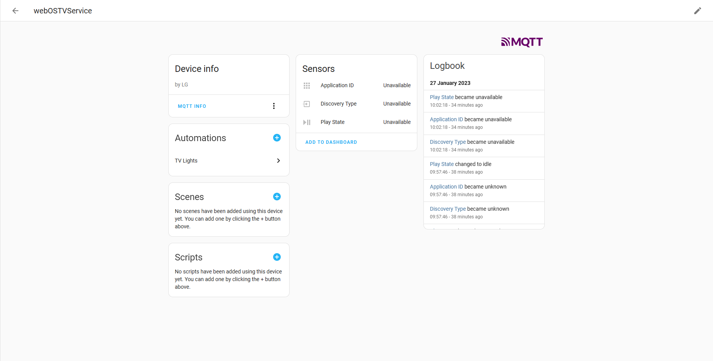

# LG2MQTT

Slimline service + app for sending Play/Pause state of LG TV to an MQTT server with Home Assistant Auto-Discovery.

Credit to SLG for doing most of the work implementing the original MQTT app (https://github.com/SLG/tv-service).

## Required Tools
- Node/npm - https://nodejs.org/en/download/
- WebOS Dev Manager (if using root method) - https://github.com/webosbrew/dev-manager-desktop/releases
- WebOS CLI Developer Tools - https://webostv.developer.lge.com/develop/tools/cli-installation

## Setup TV

There are two options:

### WebOS developer (non-root)

> Note, if using the WebOS developer route only, i.e. a non-rooted device, you will *not* be able to start the
> MQTT service at startup. This is obviously not great if you want to create automations based on the TV playing state
> and don't want to open an app every time you start the TV before doing anything else. There *is* a way to automate
> the opening off the app using Home Assistant but it isn't as neat as just having a nice background service that
> starts unobtrusively.

First, follow the steps described here for creating a developer account, installing CLI tools and setting up the TV:
[webOS Developer - Developer Mode App](https://webostv.developer.lge.com/develop/getting-started/developer-mode-app).

If all the steps above have been followed properly you should be able to run the following command and see information
about your TV (make sure your TV is actually turned on):
```
ares-device-info
```

### Rooted TV

Or you can root your tv, and get some additional options:
- So start with https://rootmy.tv
- If the above doesn't work you've probably updated your TV software and the exploit has been patched. There is another
  method explained here which *might* work: https://github.com/RootMyTV/RootMyTV.github.io/issues/85#issuecomment-1295058979
- Enable the SSH server in the *Homebrew Channel*

## Update MQTT details and package app
- Check out the code
- Update these fields in [index.js](tv-service/index.js):
```javascript
const host = 'YOUR MQTT BROKER HOST';
const port = '1883'; // OR THE POR OF THE BROKER
const username = 'YOUR MQTT USERNAME';
const password = 'YOUR MQTT PASSWORD';
```
- [Optional] If you're using this on multiple TVs you'll need to update the following field as well
```javascript
const deviceID = 'webOSTVService'
```
- Within the `tv-service` folder run the following command to get required node modules:
```shell
npm i
```
- Run the following command in the root of the repository to package and create the app:
```shell
ares-package tv-app/ tv-service/
```

## Install

### WebOS developer (non-root)

Run the following command to install the app on your TV:
```shell
ares-install ./com.yorkshireiot.lg2mqtt_0.0.1_all.ipk
```
The service and app are now installed and should be visible in the app drawer.

### Rooted TV

The easiest way is to use the WebOS Dev Manager tool. If you haven't already you'll need to add a new device with
the following details (the SSH server must be enabled in the Homebrew app, with a reboot to start the service after enabling):
- Host Address: Same IP address as before
- Port Number: `22`
- Username: `root`
- Authentication Method: `Password`
- Password: `alpine`

> N.B. This is very insecure. If you want to leave the SSH server enabled at all times you should *definitely* setup a SSH key
> instead of using the default password method. If you have no need to the SSH/Telnet servers then just turn them off.

You can then go to the App sidebar and install the app by navigating to the `.ipk` file that was generated during the packaging step.

## Open the App

This step is not strictly necessary if rooted but it's the easiest way to check everything is working. The app should autostart the
service when launched and logs should appear. Hopefully, there are no errors in the logs. If there are, go through and see what is the issue.
Double check your MQTT configuration. You can use a tool like "MQTT Explorer" to check if anything is coming to the MQTT broker at all.

If you're feeling brave you can use the CLI tools to debug the app to see what is going wrong.

TODO: Add picture of app here

If all has gone well the device should have been auto-discovered by Home Assistant and will be under Integrations->MQTT->webOSTVService


## Auto Starting

### WebOS developer (non-root)

If you're not rooted there is a slightly clunky/hacky way to open the app on startup. This method requires Home Assistant and the LG
webOS integration (https://www.home-assistant.io/integrations/webostv).

With these installed and configured go to the Developer Tools in Home Assistant and click on the `STATES` tab.
There search for your TV and click on it. If the installation above went successfully there should be an entry in the source list called
`LG 2 MQTT`. We will use this to create an automation to start the app when the TV starts.

Just click on the link below to import the blueprint for auto-starting the app when the TV turns on:

[](https://my.home-assistant.io/redirect/blueprint_import/?blueprint_url=https%3A%2F%2Fgithub.com%2FYorkshireIoT%2Flg2mqtt%2Ftree%2Fmain%2Fblueprints%2Flg2mqtt.yaml)

### Rooted TV

If you've rooted your tv, you can also use the provided script to start the service automatically when starting the TV.

1. Upload the `start_tv_service` file to `/var/lib/webosbrew/init.d` using Dev Manager tool (under files sidebar).
2. Under the terminal using the following commands to make it executable:
```shell
cd /var/lib/webosbrew/init.d
chmod +x start_tv_service
```

After that, the service should start automatically.

# TODO
- Use the app to configure the service via the tv
- Move to Typescript
